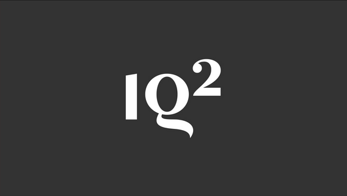

# Ready, Set, Argue! Predicting Debate Outcomes Using Tonal Features ⚔️ 

In the Oxford-style debate setting, winning is judged by the opinions of a neutral audience before and after the event. Can we <strong>algorithmically</strong> determine which side was likely to have changed more human minds? In this project, I implement feature extraction for the knowledge base, tonal, and proposition type features compiled by Jo et al. in a publically available Jupyter notebook. I use this feature extraction to train a logistic regression classifier that achieves > 75% accuracy in predicting the outcome of a debate in the IQ2 Debate Corpus, far exceeding previous results.

  
</p?

See my paper for further details and my iPython notebook for code implementation.
